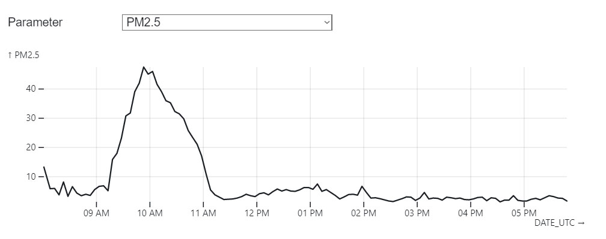

I have been exploring about air quality using the Temptop M2000 2nd Generation to [check air quality in the office](https://observablehq.com/@bttgcm/office-air-quality). Additionally, I am trying to learn ObservableHQ to communicate data.

