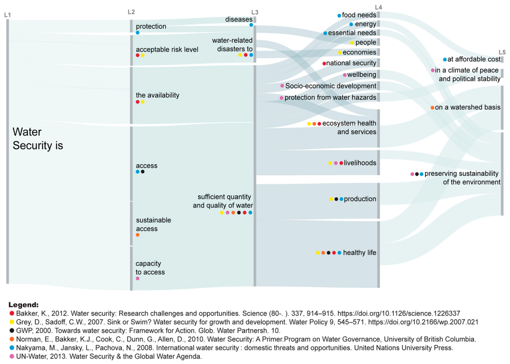

With colleagues fro the [Water Security Hub](https://www.watersecurityhub.org) we wrote an article that proposes a framework for organizing data collection for Water Security. Within the vast spectrum of definitions and concepts that already exist, we suggest a methodology to guide practitioners through this complexity.

[Read the full article](https://www.mdpi.com/2073-4441/14/18/2907).

