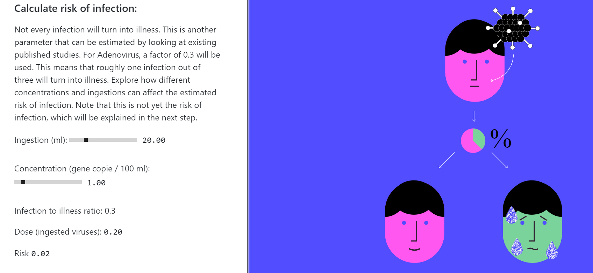

I had the opportunity of being part of risk assessment that used the Quantitative Microbial Risk Assessment (QMRA) framework. As the name already shows, the desire for academic precision creates usability difficulties by non academic.

Considering that some very interesting tools exist such as Idyll and curve note that try provide more interactive ways of engaging with the readers, we have set up a 10 minutes explanation of the QMRA framework[^1] using Idyll. It is still a draft but maybe is able to communicate the core idea behind the framework. If you have 10 minutes, [take a look](https://bttgcm.github.io/QMRA/). The idea behind the presentation is to give a preliminary understanding of the QMRA process to stakeholders that do not have a technical background.

[^1]:Quantitative microbiological risk assessment (QMRA) is the process of estimating the risk from exposure to microorganisms.
The process involves measuring known microbial pathogens or indicators and running a Monte Carlo simulation to estimate the risk of transfer. If a dose-response model is available for the microbe, it be used to estimate the probability of infection. QMRA has expanded to be used to estimate microbial risk in many fields, but is particularly important in assessments of food water supply and human faeces/wastewater safety. [wikipedia](https://en.wikipedia.org/wiki/Quantitative_microbiological_risk_assessment)

Along these ideas it is very interesting to read about the idea of the active reader[^2] as Bret Victor defines it.

[^2]:An active reader asks questions, considers alternatives, questions assumptions, and even questions the trustworthiness of the author. An active reader tries to generalize specific examples, and devise specific examples for generalities. An active reader doesn't passively sponge up information, but uses the author's argument as a springboard for critical thought and deep understanding. [From Bret Victor](http://worrydream.com/ExplorableExplanations/)

