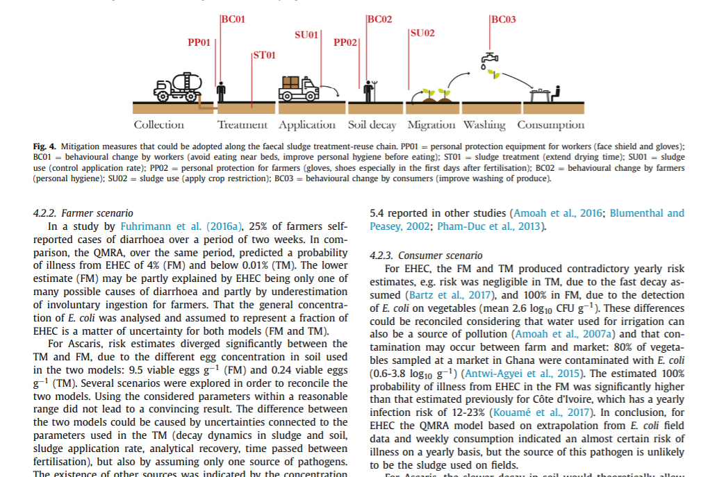

Very happy to have published with Charles Niwagaba and Annika Nordin an article on the risk assessment of wastewater sludge reuse. What we tried to quantify is the risk that consumer and workers would face while using wastewater sludge as a fertiliser. The numercial models that we built suggest that there is significant risk for both categories but also that other source of microbial contamination exist. We are now working on a policy briefing that will give suggestions on how to better address this issue in Uganda.

[Read the full article](https://pub.epsilon.slu.se/23915/1/butte_g_et_al_210527.pdf) or listen to an episode of [Paper to Practice](https://anchor.fm/paperstopractice/episodes/Episode-2-Microbial-Risk-of-Fecal-Sludge-Use-in-Ugandan-Agriculture-e11mfg1/a-a6p39s2).

